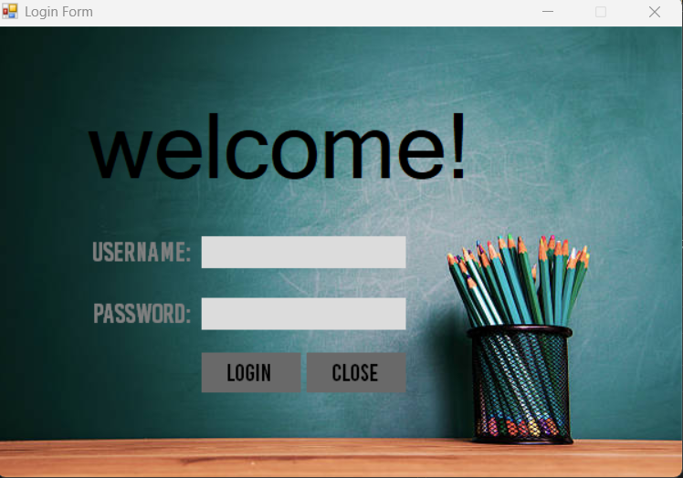
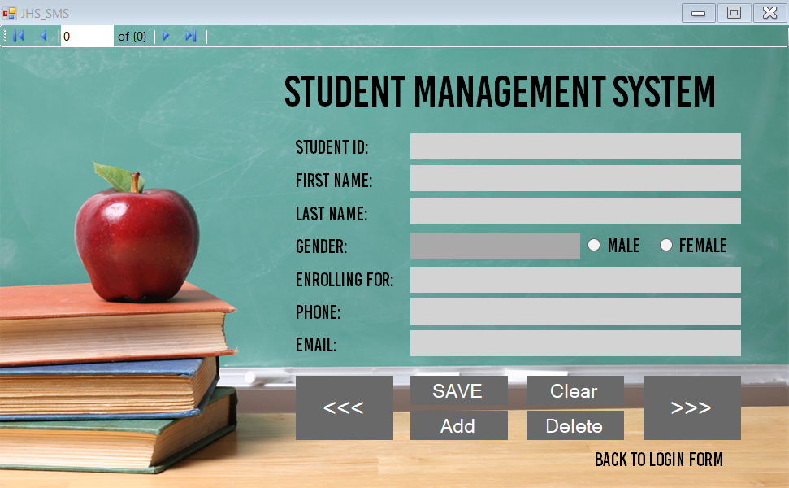

# JHS-SMS

 
 
 

JHS-SMS - Junior High School - Student Management System. This aims to store the personal information of students, made using VB.NET 2010 and Access DB.

### Author's Notes

This is my **first project**. This is the beginning of my coding journey. I was fascinated with programming at the age of 14 and VB.NET started my passion for creating software.

As of 2025, I can no longer run this project. I was able to run it up until the Login Form, but I couldn't run it to reach the Main Form. It's requiring some database dependencies from 2010, and Microsoft already took down the site for that.

To be fair, I could just update the code to support the latest VB.NET and Access. But, maybe in the future...

## Screenshots

    <h3>Login Form</h3>
    
    <h3>Main Form</h3>
    

## How to Run

Unfortunately, as of 2025, there's no *easy way* to run this. You would need the following:
1. Microsoft Visual Basic .NET 2010
1. Microsoft Access Database Engine 2010 Redistributable

Note: there's no more public downloads for these.

## Feedback

If you have any feedback/comment/request, please reach out to [aquino.ylt@gmail.com](mailto:aquino.ylt@gmail.com).

### Thank you and God bless!